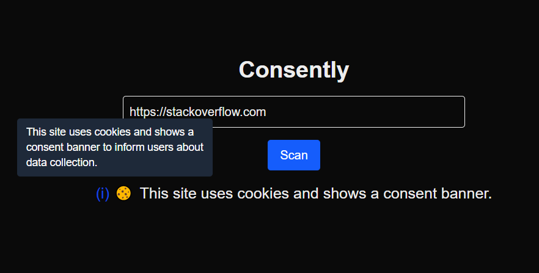

# 🍪 Consently – Cookie or Not

Consently is a minimal and elegant cookie consent component built with **Next.js (App Router)**, **TypeScript**, and **Tailwind CSS**. It gives users a choice to check whether the sites uses cookies and consent banner or not

---

## 🔧 Features

- ✅ Modern UI using Tailwind CSS
- ✅ Built with Next.js App Router (TypeScript)
- ✅ Custom favicon (Lock + Cookie themed)
- ✅ Modular component structure

---